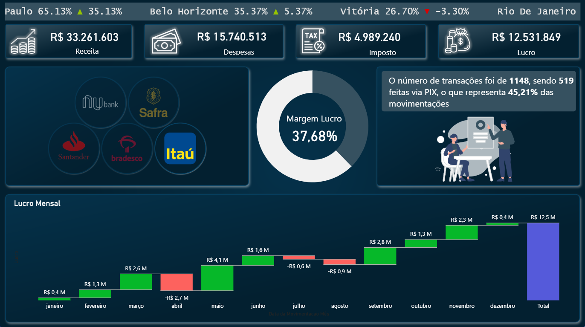

# 📊 Dashboard Financeiro em Power BI

<p align="center">
  
</p>

<p align="center">
  
  
  
  
</p>

---

## 📌 Sobre o Projeto

Este projeto consiste em um **Dashboard Financeiro** desenvolvido em **Power BI**, com foco na visualização e análise dos principais indicadores financeiros de uma empresa.

O objetivo foi consolidar informações em uma interface intuitiva e de fácil interpretação, permitindo uma análise rápida dos resultados por meio de indicadores, gráficos e visualizações interativas.

O dashboard foi desenvolvido como parte dos meus estudos em Business Intelligence, colocando em prática conceitos de modelagem de dados, Power Query, DAX e boas práticas de design para dashboards.

---

## 🎯 Objetivo

Disponibilizar uma visão executiva dos indicadores financeiros da empresa, auxiliando na análise de desempenho e apoiando a tomada de decisões.

---

## 📈 Indicadores Apresentados

- 💰 Receita Total
- 📈 Lucro
- 💸 Despesas
- 🧾 Impostos
- 📊 Margem de Lucro
- 📅 Evolução Mensal do Lucro
- 🏦 Distribuição das Movimentações por Banco
- 💳 Percentual de Pagamentos via PIX
- 🔄 Quantidade de Transações

---

## 🛠️ Tecnologias Utilizadas

- Microsoft Power BI
- Power Query
- DAX (Data Analysis Expressions)

---

## 📚 Habilidades Praticadas

- Modelagem de Dados
- Tratamento e Transformação de Dados (ETL)
- Criação de Medidas em DAX
- Desenvolvimento de KPIs
- Construção de Dashboards Executivos
- Storytelling com Dados
- Organização e Design de Layout
- Visualização de Indicadores Financeiros

---

## 📷 Preview

<p align="center">
  
</p>

---

## 💡 Principais Aprendizados

Durante o desenvolvimento deste projeto foi possível aprofundar conhecimentos em:

- Construção de dashboards voltados para indicadores financeiros;
- Organização visual para facilitar a interpretação dos dados;
- Desenvolvimento de medidas utilizando DAX;
- Criação de indicadores estratégicos (KPIs);
- Aplicação de boas práticas na elaboração de dashboards em Power BI.

---

## 📂 Estrutura do Projeto

```
dashboard-financeiro-powerbi/
│
├── Dashboard Financeiro.pbix
├── dashboard.png
└── README.md
```

---

## 📖 Referência

Este projeto foi desenvolvido para fins de estudo e prática em Power BI, utilizando como referência os conteúdos apresentados no **Intensivão de Power BI da Hashtag Treinamentos**.

---

## 👨‍💻 Autor

**Jackson Oliveira**

🔗 LinkedIn: [Jackson Oliveira](https://www.linkedin.com/in/jackson-oliveira-230b54106)

🐙 GitHub: [Jackson Oliveira](https://github.com/jacksonoliiver13)

---

⭐ Se você gostou deste projeto, fique à vontade para deixar uma estrela no repositório!
